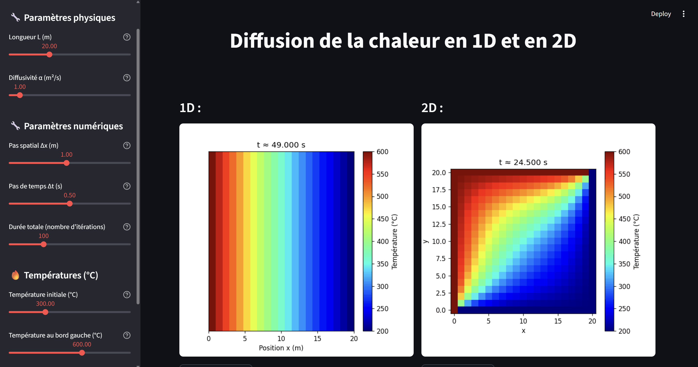

# TP1 Adell - Mrad
<br><br>

## Installer les librairies
Dans votre terminal :
```
pip install -r requirements.txt
```

```
streamlit run main.py
```
<br>

## Cliquez sur l'URL Local
```
  You can now view your Streamlit app in your browser.

  Local URL: http://localhost:XXXX
  Network URL: http://XX.XXX.XXX.XXX:XXXX
```
<br>

